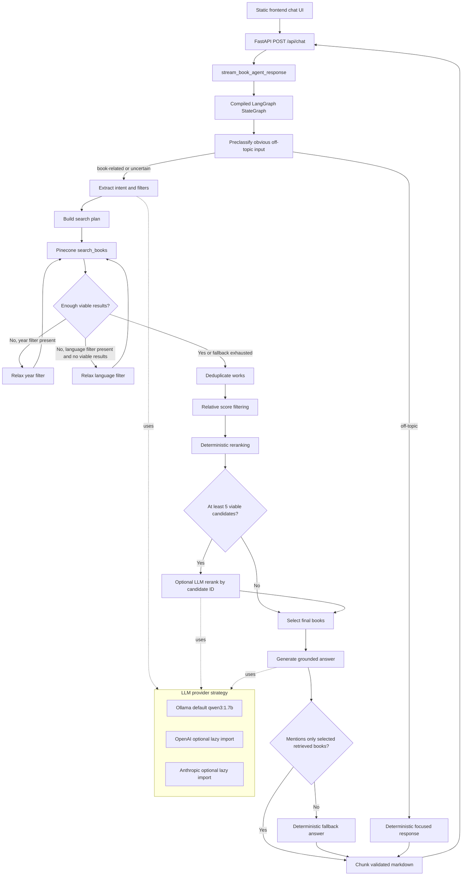

# Implementation Design

## Purpose

This document captures the planned implementation for the book recommendation
agent assignment. It is intentionally written before implementation so the
design decisions are explicit, reviewable, and aligned with the README
requirements.

The runtime agent will be implemented in:

```text
backend/app/services/book_agent.py
```

The implementation must preserve the existing FastAPI and frontend behavior.
The backend endpoint already streams Server-Sent Events; the agent function only
needs to yield text chunks.

## Source Of Truth

The assignment requirements in `README.md` are the primary source of truth:

- Accept natural-language user requests.
- Extract structured filters where possible:
  - author
  - language
  - genre/topic
  - year
- Search the Pinecone `books` index through the provided `search_books()`
  helper.
- Stream a concise answer with recommended books and reasons.
- Never recommend books that were not retrieved from the index.
- Implement the recommendation agent in `backend/app/services/book_agent.py`.
- Use LangGraph as a real `StateGraph`.

## Planned File Changes

Runtime implementation:

- `backend/app/services/book_agent.py`

Supporting files:

- `requirements.txt`
  - Add `ollama`.
  - Add `pytest`.
- `pyproject.toml`
  - Add `ollama` as a runtime project dependency.
  - Do not add `pytest` as a runtime dependency.
- `.env.example`
  - Add LLM provider configuration examples.
- `tests/`
  - Add focused pytest tests with mocked Pinecone and mocked LLM behavior.
- `IMPLEMENTATION_README.md`
  - Create later, after implementation and tests are working.

Reason: the assignment asks for the product implementation in one file. Tests,
dependency declarations, and configuration examples are supporting artifacts and
will not move runtime agent logic outside `book_agent.py`.

## High-Level Architecture

The agent will be a compiled-once LangGraph `StateGraph`. The graph object will
be created at module import time for efficiency, but request-specific settings
and provider clients will be read or created during invocation. This keeps the
graph reusable while preserving environment-driven configuration after a server
restart.



## Graph Design

The graph will use explicit state fields through a `TypedDict`. Internal domain
objects will use dataclasses. Nodes should return partial state updates instead
of mutating shared state in place.

Planned graph nodes:

1. `preclassify_request`
   - Detect obvious greetings and off-topic questions.
   - Be conservative: if a query might be about books, continue to retrieval.
2. `extract_request`
   - Combine deterministic heuristics with LLM JSON extraction.
   - If the LLM fails, use heuristics only.
3. `build_search_plan`
   - Build one to three Pinecone searches.
   - Apply hard filters only where appropriate.
4. `retrieve_books`
   - Call `search_books()` through `asyncio.to_thread()`.
   - Never call Pinecone directly.
5. `deduplicate_candidates`
   - Collapse duplicates by normalized title and author.
6. `filter_and_rank_candidates`
   - Apply relative score filtering.
   - Apply deterministic ranking boosts.
7. `llm_rerank_candidates`
   - Use only when at least five viable candidates remain.
   - Ask the model for candidate IDs in ranked order.
8. `select_recommendations`
   - Default to three recommendations.
   - Honor explicit requested count from one to five.
9. `generate_answer`
   - Ask the LLM for concise markdown using only selected books.
   - Fall back to deterministic markdown when needed.
10. `validate_answer`
    - Reject answers that appear to mention unretrieved titles.

Reason: a real graph keeps responsibilities separate, makes conditional paths
clear, and supports focused tests around individual behaviors.

## LLM Provider Strategy

The agent will use a strategy pattern for LLM providers.

Default provider:

```text
LLM_PROVIDER=ollama
OLLAMA_MODEL=qwen3:1.7b
```

Configurable environment variables:

```text
LLM_PROVIDER=ollama|openai|anthropic
LLM_TIMEOUT_SECONDS=30
LLM_TEMPERATURE=0.2

OLLAMA_BASE_URL=http://localhost:11434
OLLAMA_MODEL=qwen3:1.7b

OPENAI_API_KEY=...
OPENAI_MODEL=...
OPENAI_BASE_URL=...

ANTHROPIC_API_KEY=...
ANTHROPIC_MODEL=...
```

Provider interface:

- `name`
- `complete_text(prompt: str) -> str`
- `complete_json(prompt: str) -> Any`

Provider behavior:

- Ollama is the default and required runtime dependency.
- OpenAI and Anthropic strategies are fully implemented but use lazy imports.
- OpenAI and Anthropic SDKs are not required unless their provider is selected.
- OpenAI and Anthropic model names are required through env vars when selected.
- Missing provider configuration or unavailable provider calls should log a
  clear warning and fall back to deterministic logic when retrieval has already
  succeeded.

Reason: Ollama is the intended local model for this assignment, while the
strategy interface makes provider switching straightforward for an interviewer.

## LLM Output Handling

Structured LLM calls will request JSON output. The parser will be defensive:

- Strip Qwen/Ollama thinking blocks such as `<think>...</think>`.
- Strip markdown JSON fences.
- Extract the first balanced JSON object or array if extra text remains.
- Fall back to deterministic logic on parse failure.
- Log parse failures at warning/debug level, not to the user.

Reason: small local models can produce useful answers but often include extra
text around JSON. Robust parsing keeps the application stable.

## Intent And Extraction

The extracted request will include:

- intent:
  - `recommendation`
  - `author_lookup`
  - `title_lookup`
  - `title_reference`
  - `follow_up`
  - `off_topic`
- author query, if present
- title query or title reference, if present
- requested language, if explicit
- year constraint, if explicit
- topic/style terms
- requested recommendation count
- popularity preference
- whether the request is broad or specific

Deterministic extraction will handle:

- Explicit count requests:
  - digits
  - number words up to five
  - clamp to one through five
- Language phrases:
  - "in French"
  - "French books"
  - "English novels"
  - "written in Spanish"
- Year constraints:
  - before N
  - after N
  - between N and M
  - written/published before N
- Title references:
  - `like Frankenstein`
  - `loved "The Count of Monte Cristo"`
- Author variants:
  - original form
  - lower-case form
  - `Last, First` variant

Reason: deterministic parsing is reliable for structured signals, while the LLM
fills gaps for phrasing and intent.

## Language Handling

Use a conservative language-name-to-ISO map for common Project Gutenberg
languages:

- English: `en`
- French: `fr`
- German: `de`
- Spanish: `es`
- Italian: `it`
- Portuguese: `pt`
- Dutch: `nl`
- Latin: `la`
- Greek: `el`
- Finnish: `fi`
- Swedish: `sv`

Language detection rules:

- Treat "in French" and "written in French" as language requests.
- Treat "French books" and "English novels" as language requests.
- Treat "French revolution" as topic, not language, unless language wording is
  also present.
- Deterministic high-confidence language parsing wins over LLM extraction.

Reason: language metadata is structured and reliable enough for hard filtering,
but bare adjectives can be ambiguous.

## Filter Strategy

Use Pinecone metadata filters only for:

- `languages`
- `first_publish_year`

Do not use hard Pinecone filters for:

- author
- genre
- topic
- style
- audience
- shortness

Reason: language and publication year are structured fields. Author and topic
metadata are more brittle due to exact-match names and inconsistent subject
labels. Semantic retrieval plus reranking is safer.

Year handling:

- Use `first_publish_year` only.
- Do not infer publication timing from author birth or death years.
- Relax year filters first if strict results are too sparse.

Reason: `first_publish_year` is the closest available field for publication
timing, but it is sparse because it comes from Open Library enrichment.

## Search Plan

Each request will perform at most three Pinecone searches.

Typical searches:

1. Main semantic search using the user request plus extracted topic/style terms.
2. Optional targeted title or author/topic search for clear title-reference or
   author lookup requests.
3. Optional relaxed fallback search if strict filters return too few viable
   candidates.

Default `top_k`:

```text
20
```

Reason: twenty candidates gives enough room for filtering and reranking without
making local LLM prompts or Pinecone latency unnecessarily large.

## Title Reference Behavior

For requests like:

- "I want something like Frankenstein"
- "Suggest a book for someone who loved The Count of Monte Cristo"

The agent will:

1. Search for the referenced title.
2. Use the matched title metadata and `chunk_text` as enriched context.
3. Exclude the referenced title from final recommendations.
4. Fall back to the original user wording if the reference title is not found.

For direct title lookup requests like:

- "Find Frankenstein"

The title itself may be included.

Reason: "like X" usually asks for alternatives; "find X" asks for that title.

## Candidate Model

Each retrieved result will be converted into an internal candidate object with:

- Pinecone ID
- original score
- normalized score
- title
- authors
- languages
- subjects
- bookshelves
- download count
- first publication year
- chunk text
- source metadata

Missing metadata must be handled gracefully.

Reason: Pinecone metadata is not guaranteed to include every field. Robust
handling prevents runtime errors and improves fallback behavior.

## Deduplication

Deduplicate before score filtering.

Key:

```text
normalized title + normalized displayed authors
```

Keep the candidate with the stronger score.

Reason: if the index contains variants of the same work, the strongest variant
should represent that work before viability decisions are made.

## Score Filtering

Use relative score filtering based on the top candidate score after
deduplication.

Planned behavior:

- Normalize candidate scores by dividing by the top positive score.
- Keep candidates above a relative threshold.
- Keep a small minimum number of candidates when results are close enough.
- If all candidates are weak, return no strong recommendations and use a clear
  no-results or weak-results message.

Reason: Pinecone score distributions vary by query. Relative filtering is more
robust than a fixed global threshold.

## Deterministic Reranking

Deterministic reranking will be the backbone of candidate selection.

Signals:

- normalized Pinecone score
- explicit language compliance
- explicit year compliance
- author variant match boost
- title match/reference boost
- keyword and synonym overlap
- subject/bookshelf/chunk text overlap
- log-scaled download count boost for popularity requests

Popularity:

- Use `log(download_count + 1)`.
- Keep the weight modest so popularity does not dominate relevance.

Small synonym map:

- gothic, supernatural, horror
- revenge, vengeance
- philosophy, philosophical
- adventure, journey
- politics, revolution
- travel, voyage

Reason: deterministic scoring is faster and more predictable than relying
entirely on a small local model.

## LLM Reranking

LLM reranking is optional and conditional.

Use it only when:

- at least five viable candidates remain after deterministic filtering

Prompt shape:

- Include only the top deterministic candidates, approximately eight to ten.
- Include candidate IDs.
- Include truncated `chunk_text`, around 500 to 700 characters per candidate.
- Ask for JSON with selected candidate IDs in ranked order.

Reason: the LLM is useful for nuanced preference matching, but deterministic
ranking should keep latency and correctness under control.

## Recommendation Count

Default:

```text
3 recommendations
```

Rules:

- If the user asks for one book, return one recommendation.
- If the user asks for a number from one to five, honor it.
- Clamp recommendation count to one through five.
- Broad list requests can return up to five.

Reason: the README asks for concise answers. Three recommendations are usually
enough, while explicit user counts should be respected.

## Final Answer Format

Use concise markdown:

```text
Here are three retrieved matches for <short query summary>:

1. **Title** by Author (Year) - Reason sentence.
2. **Title** by Author (Year) - Reason sentence.
3. **Title** by Author (Year) - Reason sentence.
```

Rules:

- Use numbered lists.
- Include one short reason sentence per recommendation.
- Include year when available and useful.
- Include human-readable language only when relevant.
- Do not show internal IDs.
- Do not show Pinecone scores.
- Mention relaxed filters only when returned results depend on relaxation.
- Use "Unknown author" if author metadata is missing.
- Display up to two authors, then "et al." for more.
- Format years as integers.

Reason: this satisfies the README requirement for concise answers with reasons
while keeping the UI clean.

## Answer Grounding And Validation

The hardest requirement is:

```text
never recommends books that were not retrieved from the index
```

Enforcement:

1. The final LLM prompt will receive only selected retrieved books.
2. The prompt will explicitly forbid mentioning any title outside the supplied
   candidates.
3. The LLM will be asked for concise output.
4. The generated answer will be validated before streaming.
5. If validation detects likely unretrieved titles, discard the LLM answer and
   use deterministic markdown.

Validation approach:

- Normalize selected titles.
- Normalize answer text.
- Permit exact title matches with punctuation/article normalization.
- Avoid broad fuzzy matching.
- Treat suspicious extra title-like mentions as invalid when possible.

Reason: prompt instructions reduce risk, but validation enforces the assignment
constraint before any text is streamed to the user.

## Streaming

`stream_book_agent_response(messages)` will:

1. Invoke the compiled graph.
2. Receive the final validated answer string.
3. Yield text chunks.

Chunking rules:

- Split by small word groups or line-aware chunks.
- Avoid empty chunks.
- Avoid cutting markdown awkwardly where possible.
- Keep chunking deterministic and unit-tested.

Reason: generating the full answer before streaming allows validation to happen
before the frontend receives any text.

## Chat History

Use at most the last six user/assistant messages.

Rules:

- Ignore external `system` messages for retrieval intent.
- Include recent user and assistant messages raw but truncated.
- Use history for follow-ups like "more like the second one".

Reason: the frontend sends conversation history, and limited context improves
follow-up behavior without making prompts too large.

## Error Handling

Expected errors should produce concise, user-facing fallback behavior.

Provider errors:

- Log the issue.
- Use deterministic extraction and deterministic answer generation.
- Continue if Pinecone retrieval succeeds.

LLM JSON parse errors:

- Log warning/debug information.
- Fall back to deterministic logic.

Pinecone retrieval errors:

- Do not answer from model memory.
- Return a concise message explaining that book retrieval failed.

No viable results:

- Return a deterministic no-results response.
- If there are only weak matches, say so clearly rather than overselling them.

Reason: recommendations must be grounded in the index. If retrieval fails, the
agent should not invent results from an LLM.

## Logging

Use Python `logging`.

Suggested logged events:

- selected provider
- detected intent
- extracted filters
- number of Pinecone searches
- number of retrieved candidates
- relaxed filters
- number of viable candidates after filtering
- provider failures
- JSON parse failures
- answer validation fallback

Do not stream debug information to the user.

Reason: logs are useful for demo debugging without polluting the product UI.

## Async And Performance

Use `asyncio.to_thread()` for blocking calls:

- Pinecone `search_books()`
- synchronous provider SDK calls where applicable

Avoid unnecessary work:

- Skip provider calls for obvious off-topic input.
- Skip LLM reranking unless at least five viable candidates remain.
- Limit Pinecone searches to three.
- Truncate candidate text in prompts.
- Reuse the compiled graph.

Reason: the FastAPI route is async, but Pinecone and provider clients are mostly
synchronous. Avoiding event-loop blocking keeps streaming responsive.

## Testing Strategy

Tests should not require:

- real `.env`
- Pinecone access
- Ollama running
- OpenAI access
- Anthropic access
- OpenAI or Anthropic packages installed

Use pytest with monkeypatching/mocking.

Planned test areas:

- heuristic intent extraction
- explicit language detection
- year constraint parsing
- title-reference detection
- requested count parsing
- candidate normalization and deduplication
- relative score filtering
- deterministic reranking
- provider selection
- missing OpenAI/Anthropic package behavior
- fallback when LLM extraction fails
- fallback when final answer generation fails
- answer validation rejects unretrieved titles
- graph-level mocked flow
- public `stream_book_agent_response()` yields text chunks

Key requirement test:

- Mock the final LLM answer so it mentions an extra unretrieved title.
- Assert the streamed output falls back to retrieved-only recommendations.

Reason: tests should prove the important behavior without depending on external
services.

## Documentation Plan

After implementation and tests pass, create `IMPLEMENTATION_README.md`.

It should include:

- design summary
- provider env vars
- Ollama setup
- `ollama pull qwen3:1.7b`
- Windows setup commands
- Linux/macOS setup commands
- how to run the server
- how to run tests with `python -m pytest`
- limitations and fallback behavior

Reason: documentation should reflect the implemented system, not just the
planned design.

## Design Tradeoffs

### Why semantic-first author/topic handling?

Pinecone metadata stores author names in canonical forms such as
`Twain, Mark`, while users often write `Mark Twain` or `Twain`. Exact metadata
filters would miss valid books. Semantic retrieval plus author-aware reranking
is more robust.

### Why hard filters for language and year?

Language and publication year are structured metadata fields. They map well to
explicit user constraints. Year is sparse, so year filters are relaxed before
language filters when results are too limited.

### Why not stream directly from the LLM?

The answer must be validated before the user sees it. Direct token streaming
could leak hallucinated titles. Full generation followed by validation and
chunking is safer.

### Why deterministic fallback?

Local Ollama may be unavailable or slow. The assignment's core requirement is
retrieval-grounded recommendations, so deterministic output from retrieved
books is preferable to failing the whole request.

### Why hybrid reranking?

Deterministic ranking is predictable and fast. LLM reranking can improve nuanced
matches when enough candidates are available. Combining both gives better
quality without making the local model a single point of failure.

## Acceptance Criteria

The implementation should be considered complete when:

- `stream_book_agent_response()` uses a real compiled LangGraph `StateGraph`.
- Pinecone is accessed only through `search_books()`.
- Natural-language recommendation, author, title, title-reference, and follow-up
  requests are handled.
- Explicit language and year constraints are extracted and applied.
- Results are deduplicated, filtered, and reranked.
- Optional LLM reranking works when enough viable candidates exist.
- Final answers include recommendations and concise reasons.
- No unretrieved book can appear as a recommendation.
- Ollama is the default provider with `qwen3:1.7b`.
- OpenAI and Anthropic strategies are available through lazy imports.
- Provider failures fall back deterministically where possible.
- Tests pass without external services.
