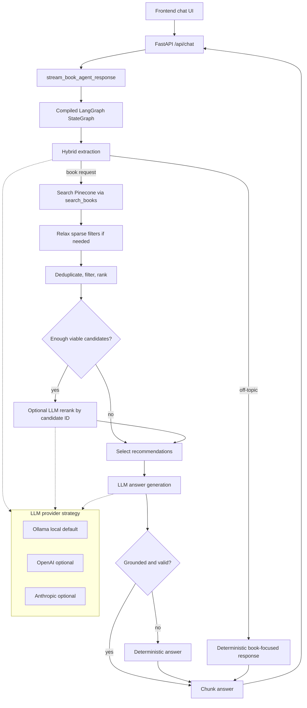

# Book Recommendation Agent Implementation

## Overview

This repository implements a streamed book recommendation agent over the provided
Pinecone `books` index.

The assignment explicitly required the agent implementation to live in one file:

```text
backend/app/services/book_agent.py
```

The implementation follows that constraint. Supporting changes are limited to
configuration examples, dependency declarations, tests, smoke tests, and this
documentation.

## Assignment Compliance

The agent supports the required behavior:

- accepts natural-language book requests;
- extracts structured signals where possible:
  - author
  - language
  - genre/topic/theme
  - publication year constraints
- searches the Pinecone index only through the provided `search_books()` helper;
- streams concise markdown answers through the existing FastAPI SSE endpoint;
- recommends only books retrieved from the index;
- uses a real compiled LangGraph `StateGraph`;
- uses Ollama as the default local LLM provider;
- includes OpenAI and Anthropic provider strategies through lazy imports;
- includes optional LLM reranking and score-based filtering.

## Architecture

Runtime flow:

```text
FastAPI /api/chat
  -> stream_book_agent_response()
  -> compiled LangGraph StateGraph
  -> extract request
  -> retrieve candidates from Pinecone
  -> deduplicate/filter/rank
  -> optional LLM rerank
  -> generate grounded answer
  -> validate answer
  -> stream chunks
```

The graph is compiled once at module load. Provider settings are read at
invocation time, so changing provider configuration only requires restarting the
server.



## Production File Structure Note

The one-file implementation is assignment-driven. In a production system, I
would split the current `book_agent.py` boundaries into focused modules:

```text
backend/app/services/book_agent/
  __init__.py
  graph.py          # LangGraph assembly and node routing
  models.py         # dataclasses, protocols, typed state
  providers.py      # Ollama, OpenAI, Anthropic strategies
  extraction.py     # deterministic + LLM request extraction
  retrieval.py      # search planning and Pinecone adapter boundary
  ranking.py        # deduplication, filtering, scoring, reranking
  answering.py      # answer generation, formatting, validation
  logging.py        # service-specific logging configuration
```

Tests would mirror those modules:

```text
tests/book_agent/
  test_providers.py
  test_extraction.py
  test_retrieval.py
  test_ranking.py
  test_answering.py
  test_graph.py
```

That structure would improve navigation, ownership boundaries, and long-term
maintainability. For this assignment, keeping runtime logic in
`backend/app/services/book_agent.py` demonstrates compliance with the README
while tests preserve confidence.

## LLM Provider Configuration

Default provider:

```env
LLM_PROVIDER=ollama
OLLAMA_BASE_URL=http://localhost:11434
OLLAMA_MODEL=qwen3:1.7b
LLM_TIMEOUT_SECONDS=60
LLM_TEMPERATURE=0.2
```

Supported providers:

| Provider | Required env vars when selected | Notes |
| --- | --- | --- |
| `ollama` | `OLLAMA_MODEL` | Default local provider. Tested live locally. |
| `openai` | `OPENAI_API_KEY`, `OPENAI_MODEL` | Lazy import. Covered by mocked unit tests only. |
| `anthropic` | `ANTHROPIC_API_KEY`, `ANTHROPIC_MODEL` | Lazy import. Covered by mocked unit tests only. |

OpenAI and Anthropic SDKs are intentionally not required unless their provider
is selected. The implementation includes provider strategies and mocked unit
tests for request shape, lazy imports, config validation, and response parsing.
They were not live-tested end to end because no OpenAI or Anthropic credentials
were available.

## Ollama Setup

Install Ollama, then pull the default model:

```bash
ollama pull qwen3:1.7b
```

Make sure the Ollama service is running before starting the app.

The local model can be changed through `.env`:

```env
OLLAMA_MODEL=llama3.2:3b
```

Small local models may occasionally return invalid formatting. The agent
validates the final answer and falls back to deterministic grounded output when
needed.

## Running The App

Windows PowerShell:

```powershell
python -m venv .venv
.\.venv\Scripts\Activate.ps1
pip install -r requirements.txt
python .\scripts\verify_setup.py
python .\scripts\run_dev.py
```

Linux/macOS:

```bash
python3 -m venv .venv
source .venv/bin/activate
pip install -r requirements.txt
python scripts/verify_setup.py
python scripts/run_dev.py
```

Then open:

```text
http://127.0.0.1:8000
```

## Logging

`scripts/run_dev.py` enables console logging for the app and the book agent.

Useful settings:

```env
BOOK_AGENT_LOG_LEVEL=INFO
```

or:

```env
BOOK_AGENT_LOG_LEVEL=DEBUG
```

`INFO` is the default. `DEBUG` includes more extraction, ranking, search, and
LLM timing detail. Logs are not streamed to the user.

## Testing

Run the full test suite:

```bash
python -m pytest -q
```

Current passing result:

```text
101 passed
```

The unit tests do not require live Pinecone, Ollama, OpenAI, or Anthropic
access. External systems are mocked where needed.

Covered areas include:

- provider strategy configuration and lazy imports;
- mocked OpenAI and Anthropic request/response behavior;
- deterministic extraction;
- LLM extraction merge behavior;
- title-reference handling;
- author filtering;
- language and year filters;
- retrieval relaxation;
- search failure handling;
- ranking and score-based filtering;
- optional LLM reranking;
- answer grounding validation;
- LangGraph flow;
- public streaming behavior.

## Smoke Testing

Run the live smoke suite:

```bash
python scripts/smoke_test_agent.py
```

Run deterministic smoke tests without the configured LLM provider:

```bash
python scripts/smoke_test_agent.py --deterministic
```

Run one scenario:

```bash
python scripts/smoke_test_agent.py --only twain_travel
```

The smoke tests use the configured live Pinecone and, unless `--deterministic`
is passed, the configured LLM provider.

## Key Design Decisions

### Hybrid Extraction

The agent combines deterministic heuristics with LLM JSON extraction.
Deterministic parsing handles high-confidence signals such as language, year,
explicit counts, author phrases, and title references. The LLM fills gaps for
more flexible phrasing. Deterministic high-confidence fields win over noisy LLM
values.

### Semantic-First Retrieval

The agent uses semantic search as the primary retrieval mechanism. Hard
Pinecone filters are applied only for structured language and year constraints.
Author and topic handling are performed through semantic retrieval plus
reranking because metadata can be inconsistent.

### Explicit Author Filtering

When the user explicitly asks for books by an author, final recommendations are
restricted to retrieved candidates matching that author. This avoids returning
semantically related books by other writers for author lookup requests.

### Filter Relaxation

If strict language/year filters are too sparse, the agent can relax filters.
Relaxation is independent: relaxing year does not relax language, and relaxing
language does not relax year.

### Optional LLM Reranking

LLM reranking is used only when there are at least five viable candidates. The
LLM receives candidate IDs and must return selected IDs. Invalid rerank output
falls back to deterministic ranking.

### Validate Before Streaming

The final answer is generated completely before streaming. This allows the
agent to validate grounding and formatting before any text reaches the user. If
the LLM answer fails validation, a deterministic answer is streamed instead.

## Grounding And Safety

The core safety rule is:

```text
Never recommend books that were not retrieved from the index.
```

The implementation enforces this by:

- passing only selected retrieved books to the answer prompt;
- validating that recommended markdown titles are selected retrieved titles;
- requiring numbered recommendation format;
- requiring unique recommendation titles;
- requiring the expected opening sentence;
- falling back deterministically when validation fails;
- refusing to answer from model memory when retrieval fails.

## Known Limitations And Future Improvements

- The one-file runtime implementation is intentional for assignment compliance,
  but not ideal for production maintainability.
- Small local models can be slow or inconsistent.
- Project Gutenberg and Open Library metadata can be sparse or noisy.
- Some semantic matches may be imperfect because the index is limited.
- The answer validator focuses on recommendation titles, not every possible
  title-like phrase in explanatory text.
- Live OpenAI and Anthropic provider behavior was not tested because credentials
  were unavailable; mocked unit tests cover their code paths.

Future improvements:

- split `book_agent.py` into production modules;
- use stricter structured answer generation;
- improve title and author entity resolution;
- add request IDs and privacy-aware logging;
- add async-native provider clients where available;
- add live integration tests behind optional environment flags;
- improve metadata normalization for Gutenberg/Open Library records.
